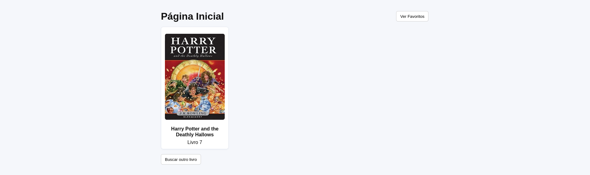
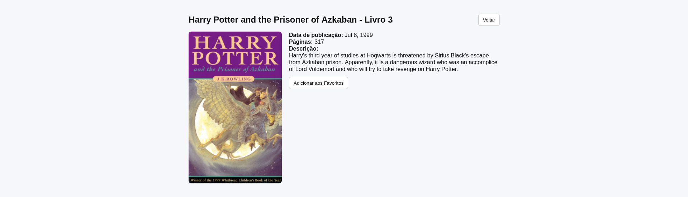
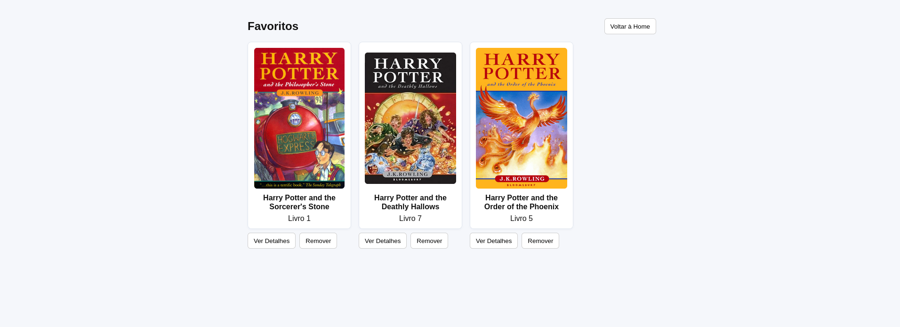

# react_vercel_app


## 📖 Sobre o Projeto

O objetivo da aplicação é consumir uma API pública de livros de **Harry Potter**, permitindo ao usuário visualizar livros aleatórios, ver seus detalhes técnicos e gerenciar uma lista de favoritos persistida localmente no navegador.

A aplicação foi desenvolvida utilizando **React + Vite** e publicada na plataforma **Vercel**.

### 🎯 Funcionalidades

A aplicação conta com 3 telas principais obrigatórias:

1.  **Tela Inicial (Home)**:
    * Consome a API `potterapi` para buscar um livro aleatório.
    * Exibe a capa e o título do livro.
    * Ao clicar na capa, redireciona para os detalhes.
    * Ao retornar para esta tela, um novo livro é carregado automaticamente.

2.  **Tela de Detalhes**:
    * Exibe informações detalhadas: Título Original, Capa, Data de Publicação, Número de Páginas e Descrição (Sinopse).
    * **Botão "Voltar"**: Retorna à home carregando um novo livro.
    * **Botão "Favoritar"**: Salva o livro atual na lista de favoritos (com feedback visual).

3.  **Tela de Favoritos**:
    * Lista todos os livros salvos pelo usuário.
    * Utiliza persistência de dados (LocalStorage ou SQLite Web) para manter a lista mesmo após recarregar a página.

---

## 🚀 Tecnologias Utilizadas

O projeto foi desenvolvido seguindo o ambiente obrigatório da disciplina:

* **Runtime**: Node.js (v20.19.*)
* **Build Tool**: Vite (v7.*)
* **Framework**: React
* **Editor**: Visual Studio Code
* **Deploy**: Vercel

---

## 📸 Screenshots

Abaixo estão as capturas de tela demonstrando o funcionamento da aplicação:

### 1. Tela Inicial

*(A tela inicial exibe um livro aleatório carregado via API)*

### 2. Tela de Detalhes do Livro

*(Detalhes completos do livro com opções de voltar ou favoritar)*

### 3. Tela de Favoritos

*(Lista persistida dos livros favoritos do usuário)*

> **Observação**: As imagens acima encontram-se na pasta do projeto. Caso não carreguem, verifique o diretório `src/assets`.

---

## 🔧 Como rodar o projeto localmente

Pré-requisitos: Node.js instalado.

1.  **Clone o repositório:**
    ```bash
    git clone [https://github.com/SEU-USUARIO/react_vercel_app.git](https://github.com/SEU-USUARIO/react_vercel_app.git)
    ```

2.  **Acesse a pasta do projeto:**
    ```bash
    cd react_vercel_app
    ```

3.  **Instale as dependências:**
    ```bash
    npm install
    ```

4.  **Execute o servidor de desenvolvimento:**
    ```bash
    npm run dev
    ```

5.  **Acesse no navegador:**
    O terminal exibirá o endereço local, geralmente: `http://localhost:5173`

---

## 📄 Licença

Creative Commons Zero v1.0 Universal.
Você tem permissão para compartilhar e adaptar este material, desde que dê o crédito apropriado ao autor original.

---
